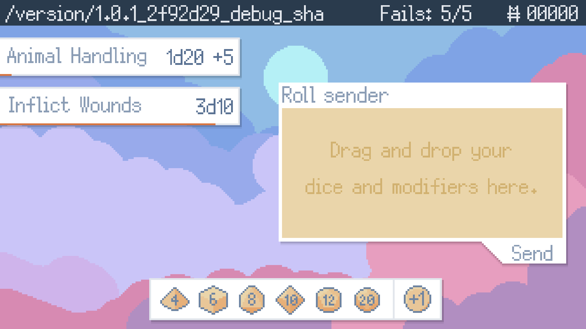

# Dice Operator

**Notes: This is a very small game created in 48 hours during the [GMTK game jam 2022](https://colinbellino.itch.io/dice). A lot of features and polish are missing due to time constraint.**

In the world of dice operator, every dice roll you make has to be done by an operator (like a phone operator).

You will received orders from players all over the world wanting to roll the dice, will you be able to keep up without making mistakes ?

Assist mode: If the game is too fast for your, activate this in the options menu (ESCAPE) to slow down time.

## How to play:

When you receive an order for a dice roll, you have to answer as soon as possible without making any mistakes. Make sure you have the correct number of dice and the correct modifiers.

Drag & drop the correct combinaison of dice and modifiers into the "Roll sender" window, then click "Sent" to submit your roll. If it is valid, the order is fulfilled and you gain money depending on the complexity.

Purple rolls are issue by a DM, you better do them quickly and don't make them wait!

~Some players will issue you brides so you give them better roll, careful not to get caught !~  Not finished in time, sorry!

Make 5 mistakes and your boss will fire you (game over).

| Order |	Dice | Modifiers (+1) |
|---|---|---|
| 1d20	| 1 die (20 faces) |	0 modifier |
| 1d6+1	| 1 die (6 faces)	| 1 modifier |
| 3d12+2|	3 dice (12 faces)	| 2 modifiers |

## Credits:

- **Art, Audio, Code, Design:** Colin Bellino
- **Paid assets:** No

## Controls:

| Actions |	Mouse/Keyboard | Gamepad |
|---|---|---|
| Drag, drop & click | Left mouse button | - |
| Confirm	| Space, Enter | - |
| Pause |	Escape | - |

## Assets

- https://poppyworks.itch.io/silver
